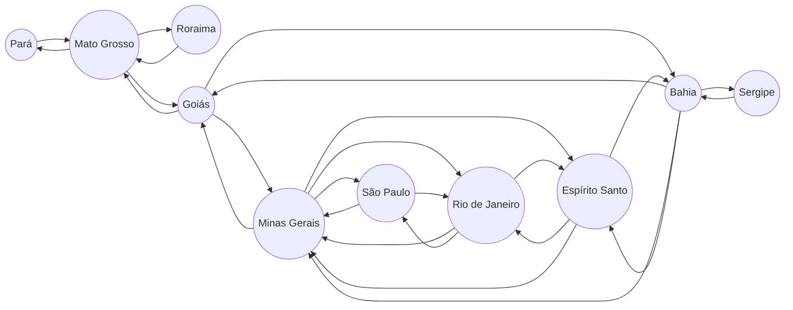

# Inteligencia Artificial :  Buscas em Grafos
Irá  ser aborda os seguintes tipos de buscas:
* Largura 
* Profundidade
* A*

# Problema Abordado
> Desenvolver um algoritmo que possibilite sair de qualquer ponto inicial e ir até qualquer objetivo (semelhante GPS)
> 
Para implementar as buscas foi escolhido um grafo de 20 nós, este grafo é uma representação dos estados Brasileiro,  a implementação do código foi feita em Python.

# Grafo
